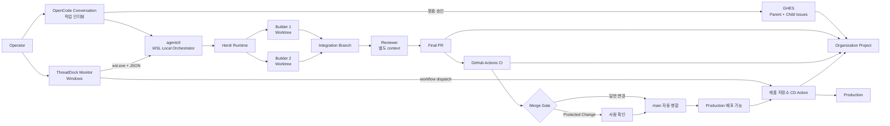

# ThreadDock 중심 GitHub Agentic 개발체계 설계

| 항목 | 값 |
|---|---|
| 상태 | **초안 — 설계 검증 중** |
| 기준일 | 2026-08-27 |
| v0.1 범위 | 개발 요청 인터뷰부터 GitHub Issue·Agent 구현·PR·CI·main 병합까지 |
| 후속 범위 | production 관측, 완전한 GitOps reconciliation, 여러 저장소 동시 실행 |
| 사용자 | 현재 2명, 개발자별 Windows 11 PC와 WSL |
| GitHub | GitHub Enterprise Server와 조직 공용 Project |
| Agent | OpenCode CLI와 사내 호스팅 모델 |
| 제품명 | **ThreadDock** |

이 문서는 ThreadDock의 제품·운영 계약을 정의한다. 개발자는 OpenCode 대화에서 구현할 기능이나 수정할 버그를 설명한다. Agent는 작업 인터뷰로 요청을 구체화하고 Parent Issue와 필요한 Child Issue 묶음을 제안한다. 사용자가 묶음을 한 번 승인하면 구현, 독립 리뷰, CI와 일반 변경의 main 병합까지 자율 실행한다.

GitHub는 영구 업무 기록이고, 개발자 PC의 WSL은 실행 장소다. WSL의 `agentctl`이 Herdr·OpenCode·Worktree를 조정하고 Windows의 ThreadDock Monitor는 상태 관찰, 중단·재개·재시도와 production Actions의 명시적 실행을 제공한다.

---

## 1. 확정한 결정

1. v0.1은 **GitHub 중심 Agent 개발체계**에 집중한다. 전체 DevOps·GitOps와 개인 비서는 후속 범위다.
2. 프로젝트 저장소는 분리하고, 여러 저장소를 아우르는 진행 상황은 조직 공용 GitHub Project에 기록한다.
3. GitHub Issue·Pull Request·Actions가 요구사항, 변경, CI/CD 결과의 영구 기준점이다.
4. OpenCode 대화가 작업 인터뷰 interface다. Agent가 Issue 묶음 미리보기를 만들고 사용자가 한 번 승인한다.
5. Parent Issue 하나는 integration branch 하나와 최종 Pull Request 하나에 대응한다.
6. 독립적으로 구현·검증할 가치가 있는 작업만 Child Issue로 만든다. 세부 실행 단계는 로컬 Task packet으로 둔다.
7. 개발자 PC 하나에서는 Parent Issue 하나만 활성화하고 Builder는 전체 최대 두 개다.
8. Builder마다 Worktree와 branch를 분리한다. v0.1의 Worktree Isolation은 충돌 방지 수단이며 보안 sandbox가 아니다.
9. Reviewer는 구현 대화를 보지 않는 별도 context에서 실행한다.
10. Reviewer와 CI가 요구한 Repair Round는 합계 두 번까지만 허용한다.
11. Merge Gate를 통과한 일반 변경은 main에 자동 병합한다.
12. 데이터·인증·권한·배포·공급망·공개 계약을 바꾸는 Protected Change는 main 병합 전에 사람이 확인한다.
13. production 배포는 사용자가 ThreadDock Monitor 또는 GHES에서 제품 저장소의 `workflow_dispatch`를 실행한다.
14. CI와 CD는 제품 저장소의 GitHub Actions에 둔다. `devops-control` 저장소를 배포 제어면으로 만들지 않는다.
15. ThreadDock Monitor는 모든 workflow 상태를 보여주고, `workflow_dispatch` workflow에만 실행 진입점을 표시한다.
16. Local Orchestrator는 Go로 구현한 `agentctl`이며 별도 HTTP 서버를 만들지 않는다.
17. Windows 앱은 Wails v2와 React·TypeScript를 사용하고 `wsl.exe agentctl ... --json`을 호출한다.
18. 배포물은 사내 GHES Releases로 제공하며 자동 다운로드, 사용자 확인 설치와 실패 시 자동 복구를 지원한다.
19. UI는 News Desk 구조와 Civic Cobalt 디자인 시스템을 사용한다.
20. production health·OTel·Grafana 지표와 자동 rollback은 v0.1에 포함하지 않는다.

## 2. 목표와 비목표

### 목표

- 비전공 Operator가 현재 상태와 자신이 해야 할 다음 행동을 5초 안에 이해한다.
- 자연어 개발 요청이 명확한 수용 조건, 범위와 Issue 구조로 바뀐다.
- GitHub만 보아도 작업 목적, 변경, 검증, 리뷰와 병합 결과를 추적할 수 있다.
- 느린 사내 모델이 멈추거나 PC·WSL이 재시작돼도 작업 결과를 잃지 않는다.
- 독립 작업 두 개를 안전하게 병렬 실행하고 통합 지점을 하나로 유지한다.
- production 배포는 사람의 명시적 행동으로만 시작된다.
- 도구와 코드를 비전공자도 운영 가능한 작은 구조로 유지한다.

### v0.1에서 하지 않는 것

- 여러 사용자가 로그인하는 중앙 Agent 플랫폼
- 둘 이상의 Parent Issue 동시 실행
- 세 개 이상의 Builder
- 여러 저장소를 한 실행에서 자동 조정
- Agent의 production 자동 배포
- 자동 rollback
- 모든 프로젝트에 강제하는 container sandbox
- Kubernetes·Argo CD·Flux
- OTel·Grafana·Loki·Tempo를 ThreadDock에 내장
- Actions 전체 로그의 로컬 영속 저장
- 동적 workflow 입력 form 생성
- Plugin marketplace와 범용 확장 시스템
- 개인 비서·일정·문서 관리

## 3. 기준점과 책임 경계

| 대상 | 기준점 | 답하는 질문 |
|---|---|---|
| 개발 요청과 수용 조건 | Parent Issue | 무엇을 왜 완료해야 하는가? |
| 독립 실행 작업 | Child Issue | 어떤 결과를 따로 구현·검증하는가? |
| 조직 전체 진행 | Organization Project | 어느 저장소의 어떤 요청이 어느 업무 상태인가? |
| 변경과 검증 | 최종 Pull Request | 무엇이 바뀌었고 어떤 근거로 병합되는가? |
| CI와 production CD | 제품 저장소 Actions | 어떤 commit을 검사·배포했고 결과는 무엇인가? |
| 저장소 상시 규칙 | `AGENTS.md` | 이 저장소에서 항상 지킬 경계는 무엇인가? |
| 도메인 언어 | `CONTEXT.md` | 이 프로젝트에서 같은 말이 무엇을 뜻하는가? |
| 코드 위치와 책임 | `docs/architecture/CODEMAP.md` | 주요 진입점과 위험한 변경 경계는 어디인가? |
| 중요한 선택 | `docs/adr/` | 되돌리기 어려운 결정을 왜 내렸는가? |
| 반복 작업 절차 | `.agents/skills/` | 이 종류의 작업을 어떤 순서로 수행하는가? |
| 실행 상태 | `agentctl` local state와 Herdr | 현재 어떤 Agent가 일하고 있고 복구 가능한가? |
| 사람용 관찰 | ThreadDock Monitor | 지금 상태와 다음 행동은 무엇인가? |

GitHub 업무 상태와 로컬 실행 상태는 서로 다르다. Herdr의 `working`, `blocked`, `done`, `idle`은 GitHub Project 상태가 아니다. 특히 `done`은 구현 완료 증거가 아니므로 commit, 변경 경로와 검증 결과로 판단한다.

## 4. 전체 구조



### 실행 Module과 interface

```text
OpenCode Skill ─┐
                ├─ agentctl interface ─ Local Orchestrator implementation
Windows Monitor ┘                       ├─ GitHub adapter
                                       ├─ Herdr adapter
                                       ├─ Git/Worktree adapter
                                       └─ local state
```

`agentctl`은 복잡한 실행 규칙을 작은 interface 뒤에 숨기는 deep module이다. OpenCode와 Windows 앱이 같은 명령 계약을 사용하므로 별도 HTTP API와 중복 orchestration 로직이 없다.

대표 명령은 다음 범위로 제한한다.

```text
agentctl start <task-contract>
agentctl status [run-id] --json
agentctl stop <run-id>
agentctl resume <run-id>
agentctl retry <run-id>
agentctl cleanup <run-id>
agentctl doctor --json
```

production dispatch 명령은 WSL CLI에 제공하지 않는다.

## 5. 대표 사용자 흐름

```text
개발자가 기능·버그 설명
→ OpenCode 작업 인터뷰
→ 목표·제외 범위·수용 조건·위험 확정
→ Parent/Child Issue 묶음 미리보기
→ 사용자 승인
→ GHES Issue 등록과 Organization Project 반영
→ Task DAG·경로 소유권·Task packet 생성
→ 최대 두 Builder 실행
→ integration branch 통합 검증
→ 별도 Reviewer 검토
→ 최종 PR과 GitHub Actions CI
→ Merge Gate
→ 일반 변경 자동 병합 / Protected Change 사람 확인 후 병합
→ ThreadDock에 production 배포 가능 표시
→ 사용자가 CD workflow 실행
→ 결과와 대상 commit 표시
```

사용자의 Issue 묶음 승인이 감독형 자율 실행의 시작점이다. 이후 범위가 바뀌지 않는 한 main 병합까지 중간 승인을 요구하지 않는다.

다음 중 하나가 바뀌면 실행을 멈추고 Issue 묶음을 다시 승인받는다.

- 사용자에게 보이는 수용 조건이나 제외 범위
- 데이터 schema 또는 공개 계약
- 인증·권한·보안 경계
- 예상하지 않은 저장소나 서비스
- Protected Change 분류
- Child Issue의 독립성이나 실행 순서

## 6. Issue와 branch 모델

```text
Parent Issue #184
├─ Child Issue #185 → Builder branch / Worktree A
├─ Child Issue #186 → Builder branch / Worktree B
└─ Integration branch → Final PR → main
```

### Parent Issue

- 개발자의 원래 목적
- 전체 수용 조건
- 제외 범위
- 위험과 Protected Change 여부
- Child Issue 관계
- 최종 Pull Request와 production CD 결과

### Child Issue

다음 조건을 모두 만족할 때만 만든다.

- 독립적으로 구현·검증할 수 있다.
- 다른 Child Issue의 결과가 입력이 아니다.
- 수정 경로가 분리된다.
- 별도 진행 추적 가치가 있다.

단순 체크리스트, 함수 하나 수정과 문구 변경은 Child Issue로 만들지 않는다.

### Branch

- integration: `agent/<parent>-integration`
- Builder: `agent/<child>-<slug>`
- main 병합 대상은 최종 PR 하나다.
- Child Issue마다 PR을 만들지 않는다.
- main 변경과 충돌이 없으면 최신 main을 integration branch에 통합하고 전체 검증을 다시 실행한다.
- 충돌이 있으면 자동 해결하지 않고 `Blocked`로 전환한다.

## 7. Agent 역할과 완료 계약

| 역할 | 책임 | 금지 | 완료 근거 |
|---|---|---|---|
| Orchestrator | 인터뷰 결과 구조화, Issue 등록, Task DAG, Worktree 배치, 통합과 GitHub 기록 | 구현 세부를 대신 작성, production dispatch | 모든 Task에 기준 commit·경로·수용 조건·검증 방법이 있음 |
| Builder | 할당 작업 구현과 로컬 검증 | 다른 Builder 경로, main 병합, production 접근 | 변경 파일, 검증 결과, commit SHA, 잔여 위험 |
| Reviewer | 별도 context에서 요구사항·diff·검증 근거 검토 | 직접 구현, 자신의 차단 의견 무시 | 차단 이슈 해소 또는 명시적 Blocked |
| Operator | Issue 묶음 승인, Protected Change 병합 확인, production dispatch | 없음 | 명시적 UI 행동과 GitHub 기록 |

Reviewer 차단과 CI 실패에 대한 Repair Round는 합계 두 번이다. 두 번 후에도 해소되지 않으면 Orchestrator가 임의로 무시하지 않고 `Blocked Run`으로 종료한다.

### Task packet

```markdown
# Task: Child Issue #185 / 작업 이름

Base: agent/184-integration @ <commit>
Worktree: <absolute-path>

Allowed paths:
- src/example/**
- tests/example/**

Protected paths:
- migrations/**
- authentication/**
- .github/workflows/**
- deployment/**

Acceptance criteria:
1. ...
2. ...

Verification:
- <targeted check>
- <type, lint or smoke command>

Result contract:
- changed files
- verification results
- commit SHA
- remaining risk or blocker
```

### 검증 cycle과 audit 기록

검증은 feedback 속도와 회귀 위험을 함께 관리하는 계층형 cycle을 따른다.

1. 구현 loop에서는 변경 범위에 맞는 Focused Verification을 실행한다.
2. Task gate에서는 Task verification과 관련 static check를 실행한다.
3. Full Suite가 60초 이하면 Task gate에서도 Full Suite를 실행한다.
4. Full Suite가 60초를 초과하면 Wave End Verification, shared-interface 변경 직후와 final PR에서 실행한다.
5. final PR에서는 Full Suite를 항상 실행한다.

Reviewer는 검증 근거가 부족하거나 이름이 명시된 의문이 있을 때만 해당 검증을 다시 실행한다. 모든 결과 근거에는 실행한 command, outcome과 duration을 기록한다.

Issue·PR audit comment는 `Decision`, `Dispatch`, `Review`, `Verification`, `Blocker`, `Integration` 중 하나로 시작한다. comment에는 짧은 summary와 evidence만 남기며 transcript, token, secret과 긴 raw terminal output은 포함하지 않는다.

## 8. 저장소 계약

제품 저장소의 권장 최소 구조다.

```text
AGENTS.md
CONTEXT.md
docs/
├─ architecture/CODEMAP.md
└─ adr/
.serena/
├─ project.yml
└─ memories/
.agents/skills/
├─ plan-work/
├─ use-codemap/
├─ implement-task/
└─ review-change/
.github/
├─ ISSUE_TEMPLATE/
├─ pull_request_template.md
└─ workflows/
   ├─ ci.yml
   └─ deploy-production.yml
scripts/agent/
├─ pre-dispatch
├─ create-task-worktree
├─ validate-builder-result
└─ prepare-integration
```

### Rule·Skill·Script

- `AGENTS.md`: 매 작업에 적용하는 짧고 강한 경계
- Skill: 작업 인터뷰, 계획, 구현, 리뷰처럼 판단이 필요한 절차
- Script: Worktree 생성, 경로 검사, 결과 검증처럼 같은 입력에 같은 결과가 필요한 동작
- GitHub 설정: main 보호와 required checks처럼 지침으로 우회할 수 없어야 하는 정책

공통 Skill은 전용 template 저장소에서 version을 관리한다. v0.1은 별도 배포 서비스를 만들지 않고, 검토한 release를 프로젝트에 반영하는 명시적 갱신 절차를 사용한다.

## 9. Local Orchestrator와 Herdr

### 작업 공간

```text
project-control/                  # canonical checkout
└─ issue-184-integration/         # integration branch
   ├─ issue-185-api/              # Builder Worktree 1
   └─ issue-186-tests/            # Builder Worktree 2
```

- 개발자 PC 한 대에 활성 Parent Issue 하나만 둔다.
- Worktree 하나에 Builder 하나를 둔다.
- Herdr는 OpenCode pane과 상태를 실행·관찰하는 runtime이다.
- Herdr의 Workspace·pane·agent ID는 실제 반환값을 저장하고 화면 순서로 추측하지 않는다.
- `agentctl` 상태 조회는 local manifest, Git, Herdr와 GHES를 합쳐 구조화된 JSON으로 반환한다.
- ThreadDock Monitor는 앱이 열려 있을 때 3~5초마다 상태를 조회한다.
- PC·WSL이 종료되면 실행 중단을 허용한다. 다음 시작 때 자동 재개하지 않고 `[재개]`를 표시한다.

### 로컬 상태

```text
~/.local/state/threaddock/
└─ runs/<run-id>/
   ├─ run.json       # 현재 snapshot, atomic replace
   └─ events.jsonl   # 상태 변경 이력
```

- GitHub가 영구 기록이고 로컬 파일은 복구 보조물이다.
- 완료된 실행 상세는 기본 7일 보존하고 정리 후보로 표시한다.
- 자동 삭제하지 않는다.
- 앱과 CLI는 `contractVersion`으로 구조화된 명령 호환성을 판단한다.
- 제품 version이 오래됐다는 이유만으로 전체 실행을 차단하지 않는다.

## 10. 느린 Agent와 실패 복구

사내 모델은 느리고 간헐적으로 멈출 수 있으므로 단순 무출력 timeout을 사용하지 않는다.

| 상황 | 처리 |
|---|---|
| `working`, 프로세스 생존 | 출력이 없어도 최대 60분 기다림 |
| 테스트·빌드 실행 | stall 시간에서 제외 |
| 작업 미완료인데 `idle/done` | Task packet을 다시 확인하고 계속하라는 지시 전달 |
| 프로세스 종료 | 저장된 session 재개 |
| 연속 Recovery Attempt 실패 | 최대 세 번 후 `Blocked` |
| commit·파일 변경·Task 완료 | Recovery Attempt 횟수 초기화 |
| Agent가 `blocked` 보고 | 자동 지시하지 않고 사람에게 판단 요청 |

Recovery Attempt는 Reviewer·CI의 Repair Round와 다른 개념이다.

### GHES 연결 실패

- 짧은 간격으로 세 번 재시도한다.
- 계속 실패하면 로컬 결과와 의도한 GitHub 작업을 보존하고 `연결 문제`로 중단한다.
- 복구 후 기존 Issue·PR을 먼저 검색해 중복 생성을 막는다.
- 연결이 불안정하면 main 병합과 production dispatch를 시도하지 않는다.

### 병합 후 문제

- main을 force-reset하지 않는다.
- 원래 Parent Issue와 병합 commit, 문제 근거를 연결한 Revert PR을 자동 생성한다.
- Revert PR 병합은 사람이 수행한다.

### Production CD 실패

- ThreadDock은 실패 step 요약과 GHES 링크를 보여주고 알림을 보낸다.
- 자동 rollback하지 않는다.
- 프로젝트에 검증된 rollback workflow가 생기면 Workflow Catalog에 일반 수동 workflow로 표시할 수 있다.

## 11. GitHub Enterprise Server 운영

### Organization Project

업무 상태는 다섯 개만 사용한다.

```text
Backlog → Ready → In Progress → Review → Done
```

- `Ready`: Issue 묶음이 승인되고 우선순위가 정해짐
- `In Progress`: 기준 commit과 Task packet이 확정됨
- `Review`: 최종 PR과 CI가 진행 중임
- `Done`: main 병합이 끝남

production 배포 결과는 별도 field 또는 Parent Issue timeline에 연결한다. Herdr 상태를 Project 상태에 그대로 복제하지 않는다.

### Merge Gate

다음 조건을 모두 만족해야 main에 병합한다.

1. Parent·Child Issue 수용 조건 충족
2. 모든 Builder 결과가 integration branch에 포함
3. Reviewer 차단 의견 없음
4. required CI checks가 최종 HEAD에서 성공
5. 최신 main과 통합한 상태에서 전체 검증 성공
6. unresolved conversation과 충돌 없음
7. branch protection이 병합 허용
8. Protected Change라면 사람 확인 완료

Merge Gate는 Agent prompt가 아니라 GitHub 설정과 결정적 Script로 검사한다.

### Workflow Catalog

- 등록 저장소의 모든 workflow와 최근 상태를 표시한다.
- `workflow_dispatch`가 없는 workflow는 상태와 GHES 링크만 보여준다.
- 입력이 없는 수동 workflow는 ThreadDock에서 내용을 확인한 뒤 실행할 수 있다.
- 입력이 필요한 workflow는 v0.1에서 GHES 화면으로 이동한다.
- 전체 Actions log는 저장하지 않는다. 실패 step과 결론만 필요할 때 읽는다.
- 앱이 꺼져 있는 동안 별도 중앙 수집을 하지 않는다. 다시 켜면 GHES 이력으로 복구한다.

### Production 권한

- WSL과 Agent에는 Actions read 권한만 제공한다.
- Windows ThreadDock Monitor가 production dispatch 권한을 가진다.
- production credential은 Windows 사용자 자격증명 저장소에 보관한다.
- 앱은 저장소, workflow와 배포 대상 commit을 보여주고 사용자가 확인한 뒤 dispatch한다.
- API 호출 실패 시 해당 GHES Actions 화면 링크를 제공한다.

GHES의 정확한 version은 도입 전 확인해 API version, fine-grained token, 자동 병합과 Project 기능 지원을 compatibility matrix에 기록한다.

## 12. ThreadDock Monitor

### 책임

- Parent·Child 관계와 전체 실행 단계 표시
- Agent 활동과 마지막 진전 시각 표시
- Worktree·branch·commit 상세 보기
- Reviewer, local check와 GitHub Actions 결과 표시
- main 병합과 production CD 결과 연결
- 중단·재개·재시도
- `workflow_dispatch` 실행과 GHES fallback 링크
- 확인 필요, Blocked, main 병합, production 실패 알림

### 책임이 아닌 것

- 작업 인터뷰
- 계획 판단
- Agent terminal 원문 저장·표시
- production 자동 배포
- 운영 metric dashboard
- 다중 사용자 계정과 RBAC

### 정보 구조

기본 화면은 세 영역으로 구성한다.

1. 탐색: 작업 현황, 저장소, 자동화 작업, 완료 기록, 설정
2. 작업 원장: 시각, 작업 번호, 제목, 쉬운 한국어 상태와 진행 단계
3. 행동 rail: 현재 필요한 행동, 검증 근거와 자동화 작업

기술 식별자는 상세 보기로 내린다.

- `Issue` → `작업 번호`
- `Agent` → `작업 에이전트`
- `CI` → `자동 검사`
- `main 병합` → `기본 브랜치 반영`
- `workflow dispatch` → `자동화 작업 실행`
- `Blocked` → `판단 필요`

### Visual system

- 구조: News Desk 작업 원장
- palette: Civic Cobalt
- platform: Windows 11, 100~200% display scale
- 기본 font: Segoe UI Variable, Pretendard와 Noto Sans KR fallback
- 밝은 회청색 canvas, 거의 흰 primary surface, cobalt primary action
- green은 완료·정상, 어두운 amber는 확인 필요
- 6–8px radius, 선택된 실행 행에만 shadow
- 색상과 함께 문구·위치·형태로 상태 전달
- 한국어 전용, keyboard navigation과 명확한 focus ring

설계 자료:

- `PRODUCT.md`
- `opendesign/mockups/thread-dock/news-desk-palettes.html`
- `opendesign/design-systems/thread-dock-product/`

## 13. 구현 구조

```text
thread-dock/
├─ main_windows.go                   # Wails Windows entry
├─ main_nonwindows.go                # WSL test용 안내 entry
├─ cmd/
│  ├─ agentctl/                   # WSL CLI
│  └─ updater/                    # Windows update helper
├─ internal/
│  ├─ orchestrator/               # state machine과 정책
│  ├─ github/                     # GHES adapter
│  ├─ herdr/                      # Herdr adapter
│  ├─ worktree/                   # Git·Worktree adapter
│  ├─ state/                      # run.json·events.jsonl
│  └─ update/                     # Release 조회·검증·복구
├─ frontend/                      # React·TypeScript UI
├─ project-template/              # Skill·Script·GitHub template
└─ docs/
```

### 구현 원칙

- 핵심 상태 전이와 권한 판단은 Go에 두고 React는 표시와 입력만 담당한다.
- Module은 실제 외부 변화점인 GHES, Herdr, Git/Worktree에만 adapter seam을 둔다.
- 별도 HTTP server, message queue, Plugin system을 만들지 않는다.
- CLI JSON contract가 OpenCode, 앱과 test의 공통 interface다.
- 한 저장소와 한 active run에 맞는 단순 자료구조부터 시작한다.
- frontend는 선택된 디자인 system token을 직접 사용한다.

## 14. 보안 모델

### 신뢰 경계

- 개발자 한 명의 Windows PC와 전용 WSL 사용자를 Trusted Workstation 하나로 본다.
- 앱 자체 login, 다중 사용자 계정과 RBAC를 만들지 않는다.
- 서로 다른 보안 등급의 저장소를 같은 WSL 사용자에 두지 않는다.
- Worktree Isolation은 보안 sandbox가 아니다.
- 프로젝트가 이미 container 개발을 지원하면 Builder Sandbox를 선택할 수 있으나 v0.1 필수 조건은 아니다.

### 의도적으로 생략하는 기능

- 중앙 인증 server
- 자체 암호화 layer
- Agent별 capability token
- webhook 수신 server
- WSL 내부 프로세스별 세밀한 ACL
- Plugin marketplace

### 반드시 유지하는 최소선

- token·secret을 저장소, terminal 인자, log와 UI에 출력하지 않는다.
- ThreadDock·Herdr 상태 directory는 사용자 전용 권한으로 둔다.
- production credential을 WSL·Agent 환경에 제공하지 않는다.
- shell 명령을 문자열 결합하지 않고 구조화된 인자로 실행한다.
- 저장소와 workflow allowlist, branch protection과 required checks를 유지한다.
- destructive 작업은 정확한 대상과 clean 상태를 먼저 확인한다.
- Herdr external check와 pane history를 끄고 Plugin을 사용하지 않는다.
- 검토한 binary, source tag, license와 checksum을 내부에 보존한다.

Herdr의 상세 위험과 설정은 [`herdr-security-review.md`](./herdr-security-review.md)를 따른다.

## 15. 배포와 업데이트

ThreadDock 자체는 사내 GHES의 전용 저장소 Release로 배포한다.

```text
ThreadDock-v0.1.0-windows-amd64.zip
├─ thread-dock-monitor.exe
├─ agentctl-linux-amd64
├─ updater.exe
├─ install-wsl.ps1
├─ VERSION
└─ SHA256SUMS
```

- Wails v2의 검토된 stable version을 고정한다.
- v3는 stable 전환과 migration 검증 후 별도 결정한다.
- 앱은 최신 Release를 자동 조회·다운로드하고 SHA-256을 확인한다.
- 실행 중인 작업이 있으면 적용을 예약한다.
- 사용자가 `[지금 업데이트]`를 확인하면 updater가 앱 종료 후 파일을 교체하고 재시작한다.
- 새 앱이 시작 성공 신호를 남기지 못하면 직전 정상 version으로 복구한다.
- 앱과 bundled `agentctl`을 함께 갱신한다.
- 강제 업데이트하지 않는다.

## 16. 도입 순서

각 단계는 한 실제 저장소에서 검증한 뒤 다음 단계로 넘어간다.

### 0단계 — 환경 확인

- 사내 GHES version과 활성 기능 기록
- pilot 저장소 하나 선택
- OpenCode provider와 session resume 방식 확인
- Herdr v0.8.2 설치 조건과 보안 checklist 통과
- Windows 11·WSL·Go·Wails build runner 확인

통과 기준: 필요한 GHES API, Actions, branch protection과 Herdr/OpenCode 실행을 작은 probe로 확인했다.

### 1단계 — GitHub 작업 계약

- Issue·PR template
- Organization Project 5단계 상태
- `AGENTS.md`, `CONTEXT.md`, `CODEMAP.md`
- 작업 인터뷰와 Issue 묶음 미리보기
- main 보호와 required checks

통과 기준: 실제 요청 하나가 Parent Issue, 최종 PR과 main 병합까지 GitHub 기록만으로 추적된다.

### 2단계 — `agentctl`과 단일 Builder

- local state와 CLI JSON contract
- OpenCode Skill과 Task packet
- Herdr adapter
- Worktree 생성·검증 Script
- Builder 한 개와 별도 Reviewer

통과 기준: 중단·재개, Reviewer 실패와 GHES 연결 실패에서 결과를 잃지 않는다.

### 3단계 — 병렬 Builder와 자동 병합

- Parent/Child Issue 구조
- integration branch
- Builder 최대 두 개
- Repair/Recovery 정책
- Merge Gate와 일반 변경 자동 병합
- Protected Change 사람 확인

통과 기준: 독립 Task 두 개가 충돌 없이 통합되고 최종 CI 근거로 main에 병합된다.

### 4단계 — ThreadDock Monitor

- Wails v2 + React Windows app
- `wsl.exe` CLI polling
- News Desk · Civic Cobalt 화면
- 실행 중단·재개·재시도
- Workflow Catalog와 production dispatch
- Windows 알림

통과 기준: 비전공 Operator가 별도 설명 없이 현재 상태, 다음 행동과 배포 결과를 찾을 수 있다.

### 5단계 — 배포와 update 완성

- 제품 저장소 CI/CD 표준
- GHES Releases package
- assisted auto-update와 rollback
- Organization Project에 CD 결과 연결

통과 기준: 선택한 main 변경을 ThreadDock에서 production에 dispatch하고 결과와 대상 commit을 확인할 수 있다.

## 17. Pilot 측정

한 저장소에서 2주 동안 실제 Issue 5~10개를 처리하며 다음을 기록한다.

- 개발 요청부터 첫 검증 완료까지 걸린 시간
- 사람이 같은 내용을 Agent에 반복 설명한 횟수
- 허용 경로 밖 수정과 범위 이탈 횟수
- 중단된 실행을 복구하는 데 걸린 시간
- Reviewer·CI가 발견한 요구사항 누락과 회귀
- 병렬화로 실제 절약한 시간
- ThreadDock 없이 GHES·Herdr를 직접 열어야 했던 횟수

Builder 두 개를 실행했다는 사실 자체는 성공 기준이 아니다. 사람의 조정 부담과 복구 시간이 줄어야 한다.

## 18. v0.1 완료 정의

- OpenCode 작업 인터뷰에서 Issue 묶음 승인까지 완료할 수 있다.
- Parent Issue에서 Child Issue, 최종 PR과 main 병합을 추적할 수 있다.
- `agentctl`이 최대 두 Builder를 Worktree로 분배하고 결과를 통합한다.
- Reviewer가 별도 context에서 실행되고 차단 의견을 우회할 수 없다.
- 일반 변경은 Merge Gate 후 자동 병합되고 Protected Change는 사람 확인을 요구한다.
- PC·WSL·Agent 중단에서 사용자 확인 후 실행을 재개할 수 있다.
- ThreadDock Monitor가 현재 상태와 다음 행동을 쉬운 한국어로 보여준다.
- 모든 Actions workflow 상태와 수동 실행 진입점을 확인할 수 있다.
- production은 Windows 앱 또는 GHES의 사용자 행동으로만 시작된다.
- 앱과 CLI update 실패 시 직전 정상 version으로 복구된다.
- GitHub가 영구 기록이고 로컬 상태 손실이 업무 기록 손실로 이어지지 않는다.

## 19. 도입 전 확인할 사실

다음은 설계 선택이 아니라 환경 확인 항목이다.

- 사내 GHES 정확한 version과 REST API version
- fine-grained token, workflow dispatch, Project와 auto-merge 지원 상태
- main branch protection을 관리자가 적용할 수 있는지
- 제품 저장소 CI와 CD workflow 이름·입력 여부
- self-hosted runner 위치, OS와 production credential 주입 방식
- OpenCode session resume와 lifecycle event의 실제 동작
- pilot 저장소의 build·test 명령과 CODEMAP 상태
- 사내 Go module·npm package·Wails dependency mirror

확인 결과가 현재 가정과 다르면 해당 adapter와 rollout 단계만 수정한다. GitHub 영구 기록, 로컬 Orchestrator와 사람 production 승인이라는 상위 경계는 유지한다.

## 20. 관련 문서

- [`PRODUCT.md`](./PRODUCT.md) — 제품 사실과 원칙
- [`CONTEXT.md`](./CONTEXT.md) — 도메인 glossary
- [`docs/adr/0001-go-wails-for-local-tools.md`](./docs/adr/0001-go-wails-for-local-tools.md) — 기술 선택
- [`docs/adr/0002-windows-monitor-uses-wsl-cli.md`](./docs/adr/0002-windows-monitor-uses-wsl-cli.md) — Windows와 WSL interface
- [`docs/adr/0003-supervised-auto-merge.md`](./docs/adr/0003-supervised-auto-merge.md) — 자동 병합과 사람 확인 경계
- [`docs/adr/0004-tiered-test-cycle.md`](./docs/adr/0004-tiered-test-cycle.md) — 계층형 검증 cycle과 audit 근거
- [`herdr-security-review.md`](./herdr-security-review.md) — Herdr 보안 검토
- [`herdr-implementation-guide.html`](./herdr-implementation-guide.html) — Herdr 구현·운영 가이드
- [`opendesign/design-systems/thread-dock-product/`](./opendesign/design-systems/thread-dock-product/) — 선택된 UI system
- [`docs/superpowers/plans/2026-08-28-threaddock-roadmap.md`](./docs/superpowers/plans/2026-08-28-threaddock-roadmap.md) — 구현 순서와 plan 간 interface

외부 기준:

- [GHES Actions workflow dispatch API](https://docs.github.com/en/enterprise-server@3.17/rest/actions/workflows?apiVersion=2022-11-28#create-a-workflow-dispatch-event)
- [GHES Releases and assets API](https://docs.github.com/en/enterprise-server@3.17/rest/releases)
- [Wails](https://github.com/wailsapp/wails)
- [Herdr Documentation](https://herdr.dev/docs/)
- [Serena](https://github.com/oraios/serena)

---

이 문서는 아직 구현 승인이 아니라 검토 중인 v0.1 제품·운영 설계다. GHES version과 pilot 저장소 확인, 실제 작업 5~10개의 측정 결과를 근거로 v0.1 도입 기준을 확정한다.
